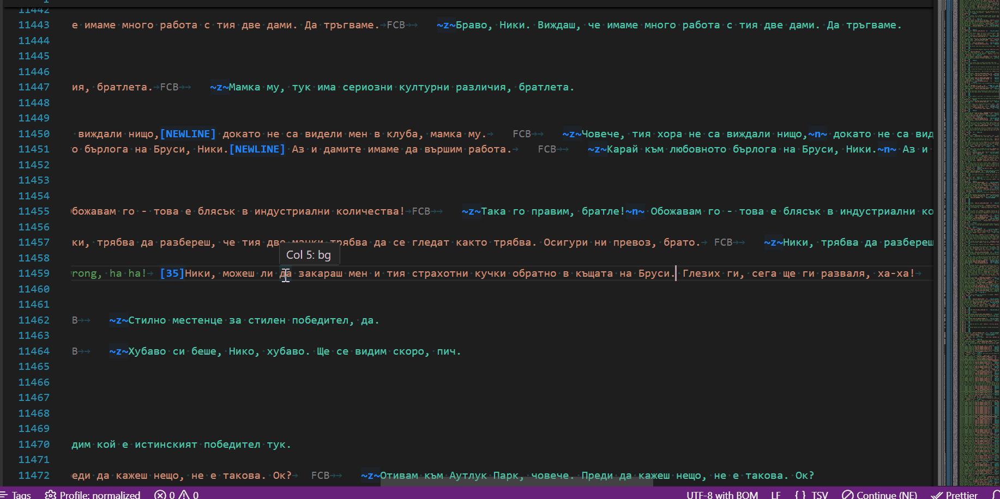
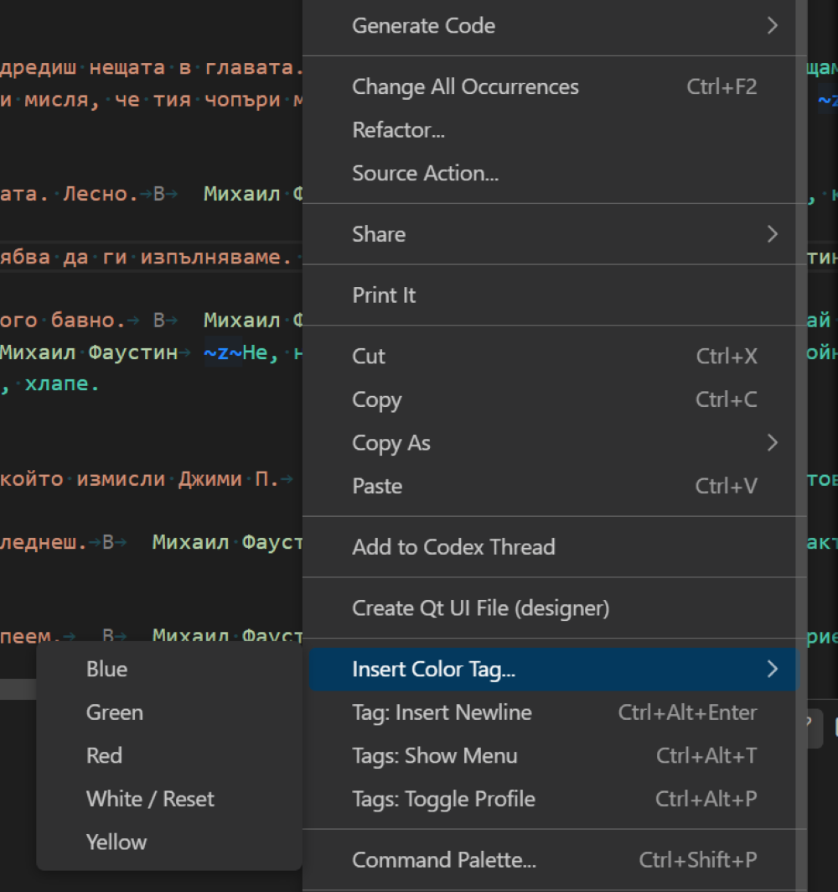
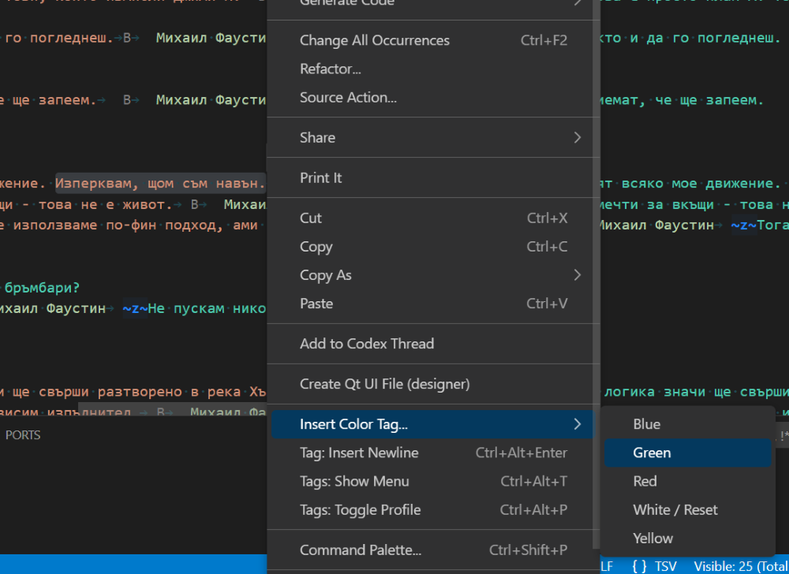
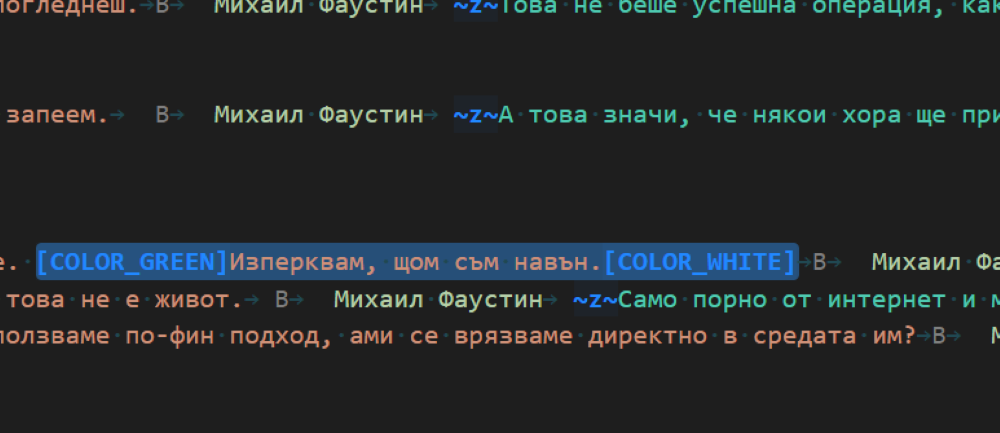
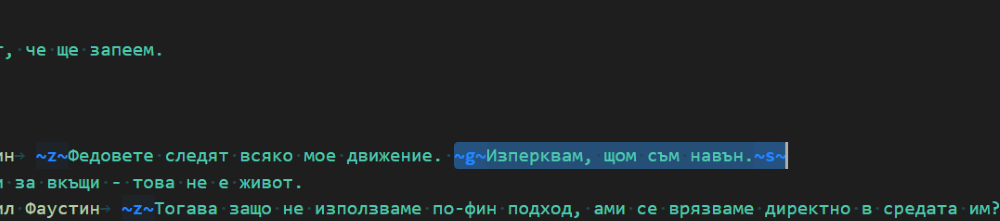

# LocFlow: Game Localization Toolkit

*Insert tags with one click, switch between raw/normalized profiles,
and see the real in-game character count.*

## Screenshots

### Context menu

Right-click integration for quick access to LocFlow actions.

---

### Apply color tag on selected text

#### Before

Selected text without any inline color tags.

#### After (Raw profile)

Color tag applied using **raw** Rockstar-style tags.

#### After (Normalized profile)

Color tag applied using **normalized** inline tags.

VS Code extension for game localization:

- inline tag highlighting
- one-click tag insertion
- visible character count
- raw / normalized profiles

A professional-grade toolkit for game translators working with Rockstar-style (GTA/RDR) and general TSV text files.

## Features

- **Smart Tag Insertion**: Insert color and newline tags via status bar, context menu, or shortcuts.
- **Smart Selection Wrapper**: Select text and click a color to wrap it: `[COLOR_RED]Text[COLOR_WHITE]`.
- **Dual Tag Highlighting**:
  - **Blue**: Formatting tags (`~n~`, `[NEWLINE]`).
  - **Orange**: Variables and placeholders (`%s`, `{0}`, `<VAR>`).
- **Live Visible Char Counter**: Shows the length of text *excluding* the game tags—perfect for fitting text into UI boxes.
- **Switchable Profiles**: Toggle between `Raw` and `Normalized` tags instantly.

## Usage

1. **Right-Click**: Access the "Insert Color Tag..." sub-menu.
2. **Status Bar**: Click "Tags" for a quick list or "Profile" to switch modes.
3. **Shortcuts**:
    - `Ctrl+Alt+Enter`: Quick Newline.
    - `Ctrl+Alt+T`: Show Tag Menu.
    - `Ctrl+Alt+P`: Toggle Profile.

## Configuration

You can customize the tags and colors in VS Code Settings:

- Change the specific strings for `raw` and `normalized` profiles.
- Change the highlight colors for tags and variables.
